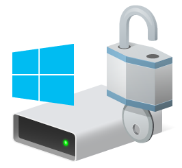

# Intune BitLocker PIN Setup

A secure, modern solution for deploying and enforcing BitLocker PIN protection through Microsoft Intune.

## Overview

This project provides a complete solution for implementing BitLocker drive encryption with PIN authentication in enterprise environments using Microsoft Intune. It features a modern, user-friendly interface that guides users through the PIN setup process while enforcing organizational security requirements.

## Features

- **Modern UI**: Clean, responsive interface for BitLocker PIN setup
- **Secure PIN Handling**: PIN is securely encrypted during the setup process
- **PIN Validation**: Prevents weak PINs through comprehensive validation rules
- **Intune Integration**: Designed for seamless deployment through Microsoft Intune
- **Detection Logic**: Includes script to verify successful implementation

## Components

- **install.cmd**: Main entry point that runs the BitLocker PIN setup process
- **SetBitLockerPin.ps1**: Core script that handles the BitLocker configuration
- **FinalBitLockerPopup.ps1**: Modern UI implementation for PIN entry and validation
- **DetectBitLockerPin.ps1**: Detection script for Intune compliance reporting
- **ServiceUI.exe**: Utility to display the UI in system context
- **Assets**: Contains branding and UI elements

## Deployment

This package is designed to be deployed as a Win32 application through Microsoft Intune:

1. Package the contents using the Microsoft Intune Win32 App Packaging Tool
2. Upload the package to Intune
3. Configure detection rules using the provided DetectBitLockerPin.ps1 script
4. Assign to user or device groups as needed

## Requirements

- Windows 10 or Windows 11
- TPM-enabled device
- Microsoft Intune

## Security Features

- PIN validation prevents sequential numbers and repeating digits
- PIN entry is masked for security
- PIN is encrypted during transit between UI and BitLocker configuration
- Temporary files are securely deleted after PIN setup

## Branding

    
    
<strong>CSG - Securing your enterprise</strong>

This solution was developed by the CSG team to meet enterprise security requirements while providing a seamless user experience. The modern, branded interface maintains organizational identity while implementing critical security controls.

## Customization

The solution can be customized with your organization's branding:

- Replace the logo images in the Assets folder
- Update color schemes in FinalBitLockerPopup.ps1
- Modify text and messaging to match your organization's terminology

## Handling Closed Dialogs

A companion script is available to handle cases where users close the BitLocker PIN dialog without setting a PIN.

### Intune Platform Script Implementation

The `CheckAndLaunchBitLockerPinSetup.ps1` script can be deployed as an Intune Platform Script:

1. In Intune admin portal, navigate to **Devices** > **Scripts** > **Add** > **Windows** > **PowerShell Script**
2. Upload the `CheckAndLaunchBitLockerPinSetup.ps1` script
3. Configure the following settings:
   - Run script in 64-bit PowerShell: **Yes**
   - Run script as signed-in user: **No** (run as system)
   - Enforce script signature check: Optional
   - Run script even when device is in use: **Yes**
   - Run this script using the logged-on credentials: **No**
4. Assign the script to the same group as your BitLocker PIN setup package

This ensures that any device where a user has closed the BitLocker dialog will be prompted again until they complete the PIN setup process.

## License

© 2025 CSG. All rights reserved.
